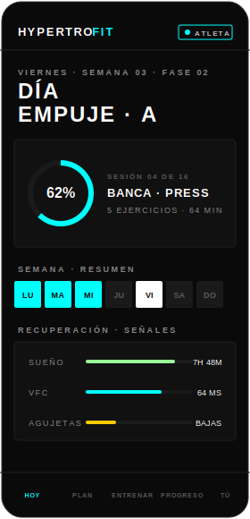
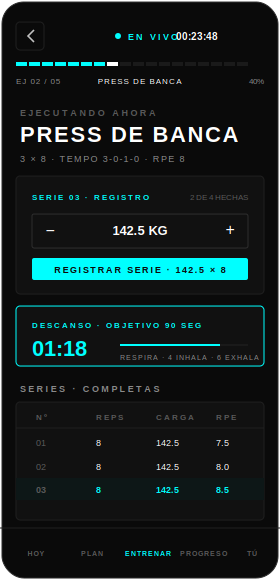
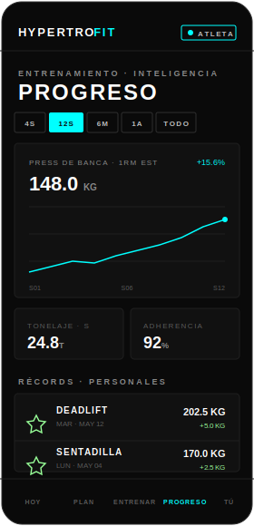
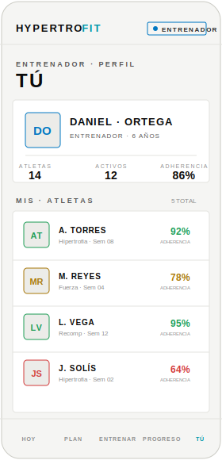
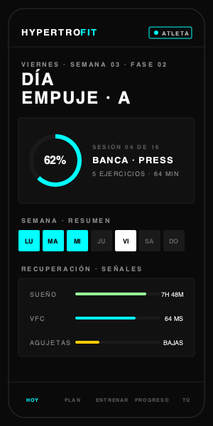

<div align="center">

# HYPERTRO·FIT

**App móvil de fitness — entrenamiento, nutrición y progreso.**

React Native puro · TypeScript · estética plana técnica (carbón/papel + señal cian/mint)

[](LICENSE)


</div>

---

Hypertrofit es una app de fitness construida a partir del *Hypertrofit Design System* de Claude. Estética **plana y técnica**: sin sombras ni gradientes, radios ≤ 4 px, tipografía geométrica en mayúsculas con tracking ancho, y una señal **cian/mint** sobre lienzo carbón (oscuro) o papel (claro).

## 📱 Capturas

<table>
  <tr>
    <td align="center"><br/><sub><b>Hoy</b> · atleta (oscuro)</sub></td>
    <td align="center"><br/><sub><b>Entrenar</b> · logger + descanso</sub></td>
    <td align="center"><br/><sub><b>Progreso</b> · e1RM + PRs</sub></td>
    <td align="center"><br/><sub><b>Tú</b> · entrenador (claro)</sub></td>
  </tr>
</table>

> [!NOTE]
> Las imágenes son **mockups de referencia** (SVG) en la estética real de la app, no capturas del dispositivo. Reemplázalas por capturas reales en `docs/screenshots/` (ej. `xcrun simctl io booted screenshot` en iOS o `adb exec-out screencap -p` en Android) manteniendo los nombres de archivo.

## 🎬 Demo

<div align="center">
  
  <br/><sub><em>Demo animada a partir de los mockups · reemplazable por un screen-recording real</em></sub>
</div>

## ✨ Características

- **5 pantallas** con navegación inferior de 5 tabs:
  - **Hoy** — panel del día: anillo de *readiness*, resumen de semana, señales de recuperación (sueño, VFC, agujetas) y nota del entrenador.
  - **Plan** — bloque de 12 semanas con barra de fases (acumulación → intensificación → realización → descarga) y la semana actual.
  - **Entrenar** — preparación de la sesión y **logger en vivo**: registro de series con `CARGA / REPS / RPE`, tabla de series y **timer de descanso**.
  - **Progreso** — tendencia de e1RM (gráfica SVG), métricas y récords personales.
  - **Tú** — perfil concentrado, adaptado al tipo de usuario.
- **3 tipos de usuario con jerarquía** (`atleta` ‹ `entrenador` ‹ `gym`):
  - **Gym** administra y hace seguimiento a entrenadores y atletas.
  - **Entrenador** hace seguimiento a sus atletas; pertenece a un gym.
  - **Atleta** gestiona su propio entrenamiento.
  - Hoy / Entrenar / Progreso muestran **información coherente por rol** (paneles de seguimiento para entrenador y gym).
- **Modo claro y oscuro** — sigue el esquema del sistema y se alterna con el botón sol/luna en la barra de marca.
- **Interfaz en español** (se mantienen `RPE` y `deadlift` en inglés).

## 🧱 Stack

- **React Native** 0.86 (CLI, sin Expo) + **TypeScript**
- **react-native-svg** — anillos, gráficas, iconos y marca
- **react-native-safe-area-context**
- Navegación por **estado simple** (sin react-navigation), replicando el prototipo
- Pruebas con **Jest**

## 📁 Estructura

```
App.tsx                     Shell: navegación por tabs + providers (tema, rol)
src/
├─ theme.ts                 Tokens y paletas DARK / LIGHT (Palette, AccentKey)
├─ ThemeContext.tsx         useTheme() — esquema activo + toggle
├─ RoleContext.tsx          useRole() — tipo de usuario activo
├─ roles.ts                 Perfiles y jerarquía (atleta/entrenador/gym)
├─ dashboards.ts            Datos de los paneles por rol (Hoy/Entrenar/Progreso)
├─ components/
│  ├─ ui.tsx                Kit de primitivas (Card, Button, Ring, Stepper…)
│  ├─ Icon.tsx              Set de iconos de línea
│  ├─ Brand.tsx             Marca vectorial (glifo + wordmark)
│  ├─ TabBar.tsx            Navegación inferior
│  ├─ Dashboard.tsx         Piezas de panel (KPIs, feed, mini-gráfica)
│  └─ DevRoleSwitcher.tsx   Selector de rol (solo desarrollo)
└─ screens/                 Today · Plan · Train · Session · Stats · You
```

Los tokens de color **no se hardcodean** en los componentes: se leen del tema activo vía `useTheme()`, y los datos referencian acentos por nombre (`AccentKey`) que se resuelven al render.

## 🚀 Puesta en marcha

Requisitos: entorno de [React Native](https://reactnative.dev/docs/environment-setup) (Node ≥ 22.11, Watchman, JDK, Android Studio y/o Xcode + CocoaPods).

```bash
# 1. Dependencias
npm install

# 2. iOS — instalar pods (primera vez y tras añadir libs nativas)
cd ios && bundle install && bundle exec pod install && cd ..

# 3. Arrancar Metro
npm start

# 4. Compilar y ejecutar (en otra terminal)
npm run ios       # o:  npm run android
```

## 🧪 Scripts

| Comando           | Descripción                  |
| ----------------- | ---------------------------- |
| `npm start`       | Servidor de Metro            |
| `npm run ios`     | Compila y ejecuta en iOS     |
| `npm run android` | Compila y ejecuta en Android |
| `npm test`        | Pruebas (Jest)               |
| `npm run lint`    | ESLint                       |

Verificación de tipos: `npx tsc --noEmit`.

## 🛠️ Notas de desarrollo

- **Switcher de rol (DEV):** botón flotante `DEV · {ROL}` abajo a la derecha; abre un menú para alternar entre atleta / entrenador / gym y revisar las vistas. Es **temporal** (`src/components/DevRoleSwitcher.tsx`) — se reemplazará por el login/roles reales antes de producción.
- **Tema:** el toggle sol/luna vive en la barra de marca; arranca siguiendo el esquema del sistema.
- **Datos:** todo el contenido es de demostración, en memoria. No hay backend todavía.

## 📄 Licencia

Distribuido bajo la licencia **MIT**. Consulta [`LICENSE`](LICENSE) para más información.

---

<div align="center">
<sub>Diseño: <em>Hypertrofit Design System</em> · QUIRÚRGICO · ASCENDENTE · LÚCIDO</sub>
</div>
